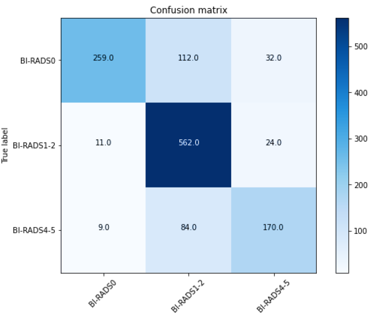

# 🩺 AI-Based BI-RADS Classification in Screening Mammography  
### Transfer Learning and Ensemble Learning Approach (TEKNOFEST 2023)

This repository presents a **professional, research-oriented deep learning pipeline** developed for the **TEKNOFEST 2023 Artificial Intelligence in Healthcare Competition**, focusing on **BI-RADS category classification and breast composition estimation** from **screening mammography images**.

The project applies **state-of-the-art transfer learning architectures**, advanced **data balancing strategies**, and **ensemble learning techniques** to improve diagnostic reliability in medical imaging. All experiments are implemented in **Python** and executed via a **Jupyter Notebook–based workflow**, ensuring full reproducibility and transparency.

---

## 📌 Project Overview

Breast cancer screening through mammography is a critical medical task that requires **high diagnostic accuracy and robustness**. In this study, we aim to automatically predict **BI-RADS categories** from mammography images using **deep convolutional neural networks**, addressing key challenges such as:

- Class imbalance  
- High-resolution medical imagery  
- Inter-class similarity  
- Clinical reliability of evaluation metrics  

The solution is designed as an **end-to-end classification framework**, combining **image preprocessing**, **transfer learning**, **custom training strategies**, and **ensemble-based decision making**.

---

## 🎯 Objectives

- Predict **BI-RADS categories** from screening mammograms  
- Evaluate multiple **transfer learning models** comparatively  
- Improve performance using **data augmentation and balancing**  
- Increase generalization with **ensemble learning**  
- Provide interpretable evaluation using **confusion matrices and class-based metrics**

---

## 📂 Dataset Description

- **Primary Dataset:** TEKNOFEST Mammography Dataset  
- **Supplementary Dataset:** RSNA Breast Cancer Detection Dataset (Kaggle)  
- **Image Format:** DICOM → JPG  
- **Resolutions Evaluated:** 512×512 and 2048×2048  
- **Data Split:**  
  - 90% Training  
  - 10% Test  
  - 10% of training used for validation  

Patient-wise separation was strictly enforced to prevent data leakage.

---

## 🧠 Methodology & Pipeline

The complete pipeline follows these steps:

1. **Data Preparation**
   - Conversion from DICOM to JPG
   - Dataset restructuring and patient-based renaming
   - Removal of noisy / non-informative images

2. **Preprocessing & Augmentation**
   - Resolution comparison (512 vs 2048)
   - Image inversion (negative images)
   - Class-aware data augmentation
   - SMOTE-based balancing at feature level

3. **Model Training**
   - Transfer learning with pretrained ImageNet weights
   - Fine-tuning with custom dense layers
   - Adaptive learning rate scheduling (custom callback)

4. **Evaluation**
   - Accuracy, Precision, Recall, F1-score
   - Confusion Matrix analysis
   - Class-based metric inspection

5. **Ensemble Learning**
   - Weighted average voting
   - Combining top-performing architectures
   - Final decision refinement

---

## 🧩 Models Evaluated

The following architectures were trained and compared:

- DenseNet169  
- EfficientNet-B2  
- **EfficientNet-B7**  
- InceptionResNetV2  
- ResNet101  
- VGG16  
- GoogLeNet  

Among these, **EfficientNet-B2 and EfficientNet-B7** achieved the most competitive results, while **ensemble learning further improved overall accuracy**.

---

## 📊 Key Results & Visual Analysis

### 🔹 Confusion Matrix – EfficientNet-B7

The confusion matrix below illustrates class-wise prediction performance and misclassification patterns:

This analysis highlights that **accuracy alone is insufficient** for imbalanced medical datasets, emphasizing the importance of **precision and recall**.

---

### 🔹 Ensemble Learning – Finding Common Ground

The figure below demonstrates how multiple high-performing models are combined to reach a more reliable consensus prediction:

Using ensemble learning, the **BI-RADS classification accuracy increased from 82.30% to 86.78%**, significantly improving clinical robustness.

---

## 🧠 Code Structure & Implementation

Although this repository contains a `.py` script for reference, the **actual GitHub implementation is notebook-based (`.ipynb`)**, structured as follows:

### 🔹 Training Workflow
- GPU configuration and memory optimization  
- Data generators using `ImageDataGenerator`  
- EfficientNet backbone with frozen / unfrozen layers  
- Custom dense head with regularization  
- Adaptive Learning Rate Adjustment (LRA Callback)

### 🔹 Evaluation Utilities
- Confusion matrix generation  
- Classification reports  
- Error analysis by class  
- Training/validation accuracy & loss visualization  

The modular design allows easy extension to new datasets or architectures.

---

## ⚙️ Technologies Used

- **Programming Language:** Python  
- **Deep Learning:** TensorFlow / Keras  
- **Computer Vision:** OpenCV  
- **Visualization:** Matplotlib, Seaborn  
- **Hardware Acceleration:** NVIDIA GPU (CUDA enabled)  
- **Dataset Sources:** TEKNOFEST, RSNA (Kaggle)

---

## 🚀 Key Contributions

✔ Medical image classification with transfer learning  
✔ Robust handling of class imbalance  
✔ Ensemble learning for performance boost  
✔ Detailed metric-driven evaluation  
✔ Competition-grade, reproducible pipeline  

---

## 🔬 Conclusion

This project demonstrates that **transfer learning combined with ensemble learning** can significantly improve **BI-RADS category prediction** in screening mammography. By carefully addressing data imbalance, preprocessing strategies, and evaluation metrics, the proposed system achieves **clinically meaningful performance gains**.

The work serves as a strong reference for:
- AI-assisted radiology  
- Medical image classification  
- Healthcare-focused deep learning research  
- Competitive AI system design  

---

## 📬 Contact

**Furkan Karakaya**  
AI & Computer Vision Engineer  
📧 se.furkankarakaya@gmail.com  

---

⭐ If you find this project useful, consider starring the repository!
